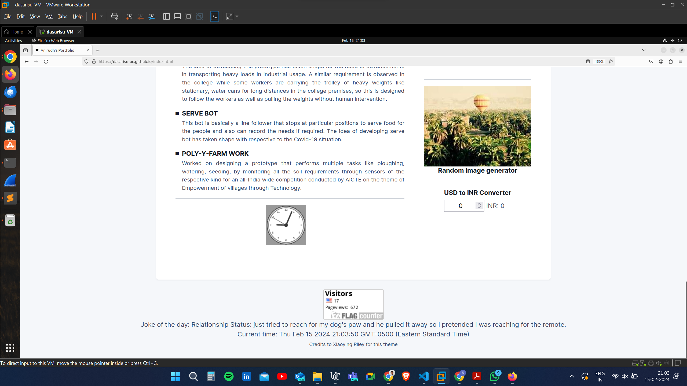
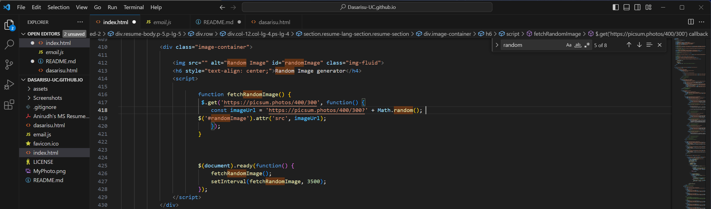

# WAPH-Web Application Programming and Hacking

## Instructor: Dr. Phu Phung

## Student

**Name**: Satya Nageswara Anirudh Dasari

**Email**: dasarisu@mail.uc.edu

**Short-bio**: Anirudh has interests in full stack web development as well as get skilled in the field of routing and switching i.e, networking as well.

## Repository Information

Respository's URL: [https://github.com/Dasarisu-UC/Dasarisu-UC.github.io](https://github.com/Dasarisu-UC/Dasarisu-UC.github.io)

This is a public repository for Anirudh Dasari to store all code for the individual Project 1. The organization of this repository is as follows.

# Individual Project 1 

## Individual Project 1 Overview
In this Individual project assignment, there are three requirements, general requirements, technical and non- technical requirements. under general requirements, I have used a bootstrap personal portfolio theme which is available for free in the internet which is developed by the developer Xiaoying Riley. In the general requirements, I have implemented my headshot, basic info about me in the portfolio, contact information, background and education, experiences and skills. Not only but also the HTML page is integrated in the portfolio which introduces Web Application Programming and Hacking course and related hands-on projects. Under Non-technical requirements, I have used the open source CSS template which is bootstrap, also I have included the page tracker in my website which counts the page views. under technical requirements, I have used Jquery to implement digital clock, analog clock, show/hide my email. For one more functionality, I have used angular JS framework for generating a functionality which is a USD to INR converter. Later, I have implmeneted joke API which updates every 60-seconds using Jquery. Next I have implemented random image generator from picsum API which generates random images every 3.5 seconds. Finally, I have implemented the JS cookies to remember the client which displays the welcome message and also it displays the welcome back message when the same user get backs to portfolio with date and time

### General Requirements

####  a. Personal Website on Github Cloud(github.io) 
In this task I have created the github cloud public repo, and pushed the developed portfolio to the repo. Where it includes the profile with my name, resume, headshot, contact informtion and background with my education details, experiences and skills.

####  b. Link to new WAPH-HTML Page

I have created the new html page, where it has all basic information of the course along with all the labs information, hackathon information and the individual project overviews.

### Non-technical Requirements

####  a. Used BootStrap CSS template
In this subtask, I have used the BootStrap CSS template, the snippet is included in the snapshot below.

####  b. Used Flag Counter for Page Tracking
In this subtask I have used flag counter href to track the website which is included in the footer of the portfolio.

### Technical Requirements

####  a. Basic JavaScript Code
In this task, I have used Jquery framework to implement and execute the digital clock, analog clock, show and hide email in the portfolio, the Jquery has been imported through the CDN in the index.html file. The code snippet and the screenshots for digital clock, analog clock has been showcased below.

The Show/hide email has been implemented in the portfolio in the list section of the page, where the code snippets and the required ouput will be displayed below.

One of the own functionality that I have implemented using Angular framework in the portfolio is the USD to INR conversion, where the related code snippet and the output in the portfolio are displayed in the below screenshots.

1.png)

2.png)

Output.png)

#### b. Two Public web APIs integration

In this task, I have used two Web API's to implement two functionalities, one is the JOKE API, where it fetches the joke of any random kind for every 60 seconds. The code snippet and the respective output is shown in the below screenshots.

The next API that I have used is to fetch the random images from the Picsum Website. The respective code snippet and the relative output is showcaased in the below screenshots.

####  c. The JS Cookied to Remember the Client

In this subtask, I have followed the hint that is given in the class lecture and implemented the JS cookies to remember the user's name every time the person visits my webpage. The relative code snippet and respective screenshot has been showcased in the below screenshots. 

When the Username is not stored in the browser Cookies, it will ask for the username for storing.

It will welcome the user once the name has been stored.

if we revisit the page, it says that the user's last visit details as a alert message in the webpage before the site loads.

